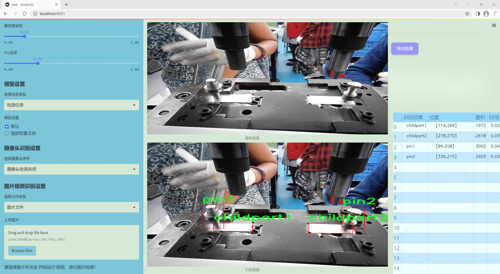

# 改进yolo11-Faster-EMA等200+全套创新点大全：制造业工作台零部件检测系统源码＆数据集全套

### 1.图片效果展示




##### 项目来源 **[人工智能促进会 2024.11.03](https://kdocs.cn/l/cszuIiCKVNis)**

注意：由于项目一直在更新迭代，上面“1.图片效果展示”和“2.视频效果展示”展示的系统图片或者视频可能为老版本，新版本在老版本的基础上升级如下：（实际效果以升级的新版本为准）

  （1）适配了YOLOV11的“目标检测”模型和“实例分割”模型，通过加载相应的权重（.pt）文件即可自适应加载模型。

  （2）支持“图片识别”、“视频识别”、“摄像头实时识别”三种识别模式。

  （3）支持“图片识别”、“视频识别”、“摄像头实时识别”三种识别结果保存导出，解决手动导出（容易卡顿出现爆内存）存在的问题，识别完自动保存结果并导出到tempDir中。

  （4）支持Web前端系统中的标题、背景图等自定义修改。

  另外本项目提供训练的数据集和训练教程,暂不提供权重文件（best.pt）,需要您按照教程进行训练后实现图片演示和Web前端界面演示的效果。

### 2.视频效果展示

[2.1 视频效果展示](https://www.bilibili.com/video/BV1ugDHY5ETA/)

### 3.背景

研究背景与意义

随着制造业的快速发展，自动化和智能化技术的应用愈发广泛，特别是在零部件检测领域，如何提高检测效率和准确性成为了行业内亟待解决的问题。传统的人工检测方法不仅耗时耗力，而且容易受到人为因素的影响，导致检测结果的不稳定性。因此，基于计算机视觉的自动化检测系统逐渐成为制造业转型升级的重要方向。YOLO（You Only Look Once）系列目标检测算法因其高效性和实时性，在工业检测中展现出良好的应用前景。

本研究旨在基于改进的YOLOv11算法，构建一个高效的制造业工作台零部件检测系统。该系统将利用包含4000张图像的“topcam12”数据集，涵盖了多种零部件类别，包括基板（baseplate）、子零件1（childpart1）、子零件2（childpart2）、压接件1（clinching1）、销钉1（pin1）和销钉2（pin2）。通过对这些零部件的精准检测，不仅可以提高生产线的自动化水平，还能有效降低人为错误，提高产品质量。

改进YOLOv11算法的引入，旨在提升模型的检测精度和速度，使其能够在复杂的制造环境中稳定运行。通过对数据集的深入分析与处理，结合先进的深度学习技术，本研究将探索如何优化模型参数，提升检测系统的鲁棒性和适应性。此外，该系统的成功实施将为制造业提供一个可复制的解决方案，推动智能制造的进一步发展。

综上所述，本研究不仅具有重要的理论意义，还将为实际生产提供切实可行的技术支持，助力制造业在智能化转型过程中实现更高的效率和质量标准。

### 4.数据集信息展示

##### 4.1 本项目数据集详细数据（类别数＆类别名）

nc: 6
names: ['baseplate', 'childpart1', 'childpart2', 'clinching1', 'pin1', 'pin2']


该项目为【目标检测】数据集，请在【训练教程和Web端加载模型教程（第三步）】这一步的时候按照【目标检测】部分的教程来训练

##### 4.2 本项目数据集信息介绍

本项目数据集信息介绍

本项目所使用的数据集名为“topcam12”，旨在为改进YOLOv11的制造业工作台零部件检测系统提供高质量的训练数据。该数据集专注于制造业领域，特别是针对工作台上常见的零部件进行检测与识别。数据集中包含六个主要类别，分别为“baseplate”、“childpart1”、“childpart2”、“clinching1”、“pin1”和“pin2”。这些类别涵盖了工作台上多种关键零部件，能够有效支持模型在实际应用中的准确性和鲁棒性。

“topcam12”数据集的构建过程注重数据的多样性和代表性，确保每个类别的样本数量充足且具有一定的变异性。这种设计使得模型在训练过程中能够学习到不同零部件在不同角度、光照条件和背景下的特征，从而提升其在真实场景中的检测能力。此外，数据集中的每个样本均经过精确标注，确保模型能够在训练时获得准确的监督信号，进而提高检测精度。

在制造业中，零部件的快速、准确检测对于生产效率和产品质量至关重要。通过使用“topcam12”数据集，改进后的YOLOv11模型将能够在复杂的工作环境中快速识别并定位各种零部件，进而为自动化生产线的智能化升级提供有力支持。该数据集不仅为模型的训练提供了坚实的基础，也为后续的模型评估和优化提供了丰富的数据资源，确保最终系统能够在实际应用中表现出色。通过这种方式，我们期望能够推动制造业智能检测技术的发展，提升整体生产效率和质量控制水平。


### 5.全套项目环境部署视频教程（零基础手把手教学）

[5.1 所需软件PyCharm和Anaconda安装教程（第一步）](https://www.bilibili.com/video/BV1BoC1YCEKi/?spm_id_from=333.999.0.0&vd_source=bc9aec86d164b67a7004b996143742dc)


[5.2 安装Python虚拟环境创建和依赖库安装视频教程（第二步）](https://www.bilibili.com/video/BV1ZoC1YCEBw?spm_id_from=333.788.videopod.sections&vd_source=bc9aec86d164b67a7004b996143742dc)

### 6.改进YOLOv11训练教程和Web_UI前端加载模型教程（零基础手把手教学）

[6.1 改进YOLOv11训练教程和Web_UI前端加载模型教程（第三步）](https://www.bilibili.com/video/BV1BoC1YCEhR?spm_id_from=333.788.videopod.sections&vd_source=bc9aec86d164b67a7004b996143742dc)


按照上面的训练视频教程链接加载项目提供的数据集，运行train.py即可开始训练



     Epoch   gpu_mem       box       obj       cls    labels  img_size
     1/200     20.8G   0.01576   0.01955  0.007536        22      1280: 100%|██████████| 849/849 [14:42<00:00,  1.04s/it]
               Class     Images     Labels          P          R     mAP@.5 mAP@.5:.95: 100%|██████████| 213/213 [01:14<00:00,  2.87it/s]
                 all       3395      17314      0.994      0.957      0.0957      0.0843

     Epoch   gpu_mem       box       obj       cls    labels  img_size
     2/200     20.8G   0.01578   0.01923  0.007006        22      1280: 100%|██████████| 849/849 [14:44<00:00,  1.04s/it]
               Class     Images     Labels          P          R     mAP@.5 mAP@.5:.95: 100%|██████████| 213/213 [01:12<00:00,  2.95it/s]
                 all       3395      17314      0.996      0.956      0.0957      0.0845

     Epoch   gpu_mem       box       obj       cls    labels  img_size
     3/200     20.8G   0.01561    0.0191  0.006895        27      1280: 100%|██████████| 849/849 [10:56<00:00,  1.29it/s]
               Class     Images     Labels          P          R     mAP@.5 mAP@.5:.95: 100%|███████   | 187/213 [00:52<00:00,  4.04it/s]
                 all       3395      17314      0.996      0.957      0.0957      0.0845


###### [项目数据集下载链接](https://kdocs.cn/l/cszuIiCKVNis)

### 7.原始YOLOv11算法讲解


其实到了YOLOV11 基本创新点就不太多了，主要就是大家互相排列组合复用不同的网络模块、损失函数和样本匹配策略，需要注意YOLO V5、V8 V11
都是1个公司的，其余的个人建议看看V8的，剩下的了解就好。

V11支持多种视觉任务：物体检测、实例分割、图像分类、姿态估计和定向物体检测（OBB）。

##### YOLOv11
基本和YOLOV8同源，甚至git目前都是1个，部分代码注释还是YOLOV8的，所以建议先看我写的YOLOV8相关博客，对比YOLOV8主要涉及到：

*backbone 中的使用C2f模块 变为 c3k2 模块。

*backbone 中的最后一层（sppf层）后增加了C2PSA模块。

*head 解耦头中的分类检测头两个Conv 变为 DWConv。

整体技术而言：

*backbone 使用了C2K2模块+最后SPPF模块级联C2PSA模块；

*neck 使用PAN结构，并且里面也使用C3K2模块；

*head使用了anchor-free + Decoupled-head，其中回归头使用正常的卷积，分类头使用DWConv；

*损失函数使用了分类BCE、回归CIOU + VFL的组合；

*框匹配策略由静态匹配改为了Task-Aligned Assigner匹配方式；

*训练策略没有提及，其中YOLOV8可以参考如下最后 10 个 epoch 关闭 Mosaic 的操作、训练总 epoch 数从 300 提升到了 500。

##### 主要思路


配置文件：[ultralytics/ultralytics/cfg/models/11/yolo11.yaml at main ·
ultralytics/ultralytics ·
GitHub](https://github.com/ultralytics/ultralytics/blob/main/ultralytics/cfg/models/11/yolo11.yaml
"ultralytics/ultralytics/cfg/models/11/yolo11.yaml at main ·
ultralytics/ultralytics · GitHub")

解析函数：[ultralytics/ultralytics/nn/tasks.py at main · ultralytics/ultralytics ·
GitHub](https://github.com/ultralytics/ultralytics/blob/main/ultralytics/nn/tasks.py#L934
"ultralytics/ultralytics/nn/tasks.py at main · ultralytics/ultralytics ·
GitHub")


##### 具体细节

##### input

输入要求以及预处理，可选项比较多，可以参考这个配置文件：[ultralytics/ultralytics/cfg/default.yaml at main
· ultralytics/ultralytics ·
GitHub](https://github.com/ultralytics/ultralytics/blob/main/ultralytics/cfg/default.yaml
"ultralytics/ultralytics/cfg/default.yaml at main · ultralytics/ultralytics ·
GitHub") 的Hyperparameters 部分。

基础输入仍然为640*640。预处理就是熟悉的letterbox（根据参数配置可以为不同的缩放填充模式，主要用于resize到640）+
转换rgb、chw、int8(0-255)->float（0-1），注意没有归一化操作。需要注意的是作者实现的mosaic和网上看到的不同，对比如下图（左边网上版本，右边是YOLO的实现）。并且作者添加了在最后10轮关闭mosaic增强（YOLOV8开始支持，具体原因个人的经验如我的这篇文章：yolov5
mosaic相关，关闭参数在 Train settings 部分的close_mosaic 选项）


##### backbone

主干网络以及改进

这里不去特意强调对比YOLOv5、V8等等的改进，因为各个系列都在疯狂演进，个人认为没必要花费时间看差异，着重看看一些比较重要的模块即可。源代码：

大多数模块：[ultralytics/ultralytics/nn/modules/block.py at main ·
ultralytics/ultralytics ·
GitHub](https://github.com/ultralytics/ultralytics/blob/main/ultralytics/nn/modules/block.py
"ultralytics/ultralytics/nn/modules/block.py at main · ultralytics/ultralytics
· GitHub")

head 部分：[ultralytics/ultralytics/nn/modules/head.py at main ·
ultralytics/ultralytics ·
GitHub](https://github.com/ultralytics/ultralytics/blob/main/ultralytics/nn/modules/head.py
"ultralytics/ultralytics/nn/modules/head.py at main · ultralytics/ultralytics
· GitHub")

串联模块构造网络：[ultralytics/ultralytics/nn/tasks.py at main ·
ultralytics/ultralytics ·
GitHub](https://github.com/ultralytics/ultralytics/blob/main/ultralytics/nn/tasks.py
"ultralytics/ultralytics/nn/tasks.py at main · ultralytics/ultralytics ·
GitHub")

##### 1）CBS 模块（后面叫做Conv）

就是pytorch 自带的conv + BN +SiLU，这里对应上面的配置文件的Conv 的 args 比如[64, 3, 2] 就是 conv2d
的c2=64、k=3、 s =2、c1 自动为上一层参数、p 为自动计算，真实需要计算scales 里面的with 和 max_channels 缩放系数。

这里连续使用两个3*3卷积stride为2的CBS模块直接横竖各降低了4倍分辨率（整体变为原来1/16）。这个还是比较猛的，敢在如此小的感受野下连续两次仅仅用一层卷积就下采样,当然作为代价它的特征图还是比较厚的分别为16、32。


    
    
        class Conv(nn.Module):
        """Standard convolution with args(ch_in, ch_out, kernel, stride, padding, groups, dilation, activation)."""
    
        default_act = nn.SiLU()  # default activation
    
        def __init__(self, c1, c2, k=1, s=1, p=None, g=1, d=1, act=True):
            """Initialize Conv layer with given arguments including activation."""
            super().__init__()
            self.conv = nn.Conv2d(c1, c2, k, s, autopad(k, p, d), groups=g, dilation=d, bias=False)
            self.bn = nn.BatchNorm2d(c2)
            self.act = self.default_act if act is True else act if isinstance(act, nn.Module) else nn.Identity()
    
        def forward(self, x):
            """Apply convolution, batch normalization and activation to input tensor."""
            return self.act(self.bn(self.conv(x)))
    
        def forward_fuse(self, x):
            """Perform transposed convolution of 2D data."""
            return self.act(self.conv(x))

##### 2）c3k2 模块

##### Bottleneck

有两种结构，需要参数shortcut和两个conv的宽度是否相同来控制。

##### C3 & C3K

都是CSP bottleneck module with 3 convolutions, C3 代表3个卷积层，
K代表其中bottleneck中的卷积核为支持自定义，其实这里c3k作者使用的默认的3*3卷积核也就等同于使用c3(c3是3*3卷积核)。

##### c2f & c3k2

其实也就是仿照YOLOv7 的ELAN
结构，通过更多的分支夸层链接，丰富了模型的梯度流。C3K2模块其实就是C2F模块转变出来的，它代码中有一个设置，就是当c3k这个参数为FALSE的时候，C3K2模块就是C2F模块，也就是说它的Bottleneck是普通的Bottleneck；反之当它为true的时候，将Bottleneck模块替换成C3K模块。模块中存在
Split 等操作对特定硬件部署没有之前那么友好了。需要针对自己的硬件进行测试看对最终推理速度的影响。

可视化关系如下，这里需要注意配置文件中的参数，比如21行[-1, 2, C3k2, [512, False, 0.25]]
512代表宽度、false代表是否使用shortcut、0.25代表c2f的宽度缩放。也就是第一个Conv的输出宽度。


源代码如下:

    
    
    class Bottleneck(nn.Module):
        """Standard bottleneck."""
    
        def __init__(self, c1, c2, shortcut=True, g=1, k=(3, 3), e=0.5):
            """Initializes a standard bottleneck module with optional shortcut connection and configurable parameters."""
            super().__init__()
            c_ = int(c2 * e)  # hidden channels
            self.cv1 = Conv(c1, c_, k[0], 1)
            self.cv2 = Conv(c_, c2, k[1], 1, g=g)
            self.add = shortcut and c1 == c2
    
        def forward(self, x):
            """Applies the YOLO FPN to input data."""
            return x + self.cv2(self.cv1(x)) if self.add else self.cv2(self.cv1(x))
    
    class C3(nn.Module):
        """CSP Bottleneck with 3 convolutions."""
    
        def __init__(self, c1, c2, n=1, shortcut=True, g=1, e=0.5):
            """Initialize the CSP Bottleneck with given channels, number, shortcut, groups, and expansion values."""
            super().__init__()
            c_ = int(c2 * e)  # hidden channels
            self.cv1 = Conv(c1, c_, 1, 1)
            self.cv2 = Conv(c1, c_, 1, 1)
            self.cv3 = Conv(2 * c_, c2, 1)  # optional act=FReLU(c2)
            self.m = nn.Sequential(*(Bottleneck(c_, c_, shortcut, g, k=((1, 1), (3, 3)), e=1.0) for _ in range(n)))
    
        def forward(self, x):
            """Forward pass through the CSP bottleneck with 2 convolutions."""
            return self.cv3(torch.cat((self.m(self.cv1(x)), self.cv2(x)), 1))
    
    class C3k(C3):
        """C3k is a CSP bottleneck module with customizable kernel sizes for feature extraction in neural networks."""
    
        def __init__(self, c1, c2, n=1, shortcut=True, g=1, e=0.5, k=3):
            """Initializes the C3k module with specified channels, number of layers, and configurations."""
            super().__init__(c1, c2, n, shortcut, g, e)
            c_ = int(c2 * e)  # hidden channels
            # self.m = nn.Sequential(*(RepBottleneck(c_, c_, shortcut, g, k=(k, k), e=1.0) for _ in range(n)))
            self.m = nn.Sequential(*(Bottleneck(c_, c_, shortcut, g, k=(k, k), e=1.0) for _ in range(n)))
    
    class C2f(nn.Module):
        """Faster Implementation of CSP Bottleneck with 2 convolutions."""
    
        def __init__(self, c1, c2, n=1, shortcut=False, g=1, e=0.5):
            """Initializes a CSP bottleneck with 2 convolutions and n Bottleneck blocks for faster processing."""
            super().__init__()
            self.c = int(c2 * e)  # hidden channels
            self.cv1 = Conv(c1, 2 * self.c, 1, 1)
            self.cv2 = Conv((2 + n) * self.c, c2, 1)  # optional act=FReLU(c2)
            self.m = nn.ModuleList(Bottleneck(self.c, self.c, shortcut, g, k=((3, 3), (3, 3)), e=1.0) for _ in range(n))
    
        def forward(self, x):
            """Forward pass through C2f layer."""
            y = list(self.cv1(x).chunk(2, 1))
            y.extend(m(y[-1]) for m in self.m)
            return self.cv2(torch.cat(y, 1))
    
        def forward_split(self, x):
            """Forward pass using split() instead of chunk()."""
            y = list(self.cv1(x).split((self.c, self.c), 1))
            y.extend(m(y[-1]) for m in self.m)
            return self.cv2(torch.cat(y, 1))
    
    class C3k2(C2f):
        """Faster Implementation of CSP Bottleneck with 2 convolutions."""
    
        def __init__(self, c1, c2, n=1, c3k=False, e=0.5, g=1, shortcut=True):
            """Initializes the C3k2 module, a faster CSP Bottleneck with 2 convolutions and optional C3k blocks."""
            super().__init__(c1, c2, n, shortcut, g, e)
            self.m = nn.ModuleList(
                C3k(self.c, self.c, 2, shortcut, g) if c3k else Bottleneck(self.c, self.c, shortcut, g) for _ in range(n)
            )

##### 3）sppf 模块

对比spp，将简单的并行max pooling 改为串行+并行的方式。对比如下（左边是SPP，右边是SPPF）：


    
    
        class SPPF(nn.Module):
        # Spatial Pyramid Pooling - Fast (SPPF) layer for YOLOv5 by Glenn Jocher
        def __init__(self, c1, c2, k=5):  # equivalent to SPP(k=(5, 9, 13))
            super().__init__()
            c_ = c1 // 2  # hidden channels
            self.cv1 = Conv(c1, c_, 1, 1)
            self.cv2 = Conv(c_ * 4, c2, 1, 1)
            self.m = nn.MaxPool2d(kernel_size=k, stride=1, padding=k // 2)
    
        def forward(self, x):
            x = self.cv1(x)
            with warnings.catch_warnings():
                warnings.simplefilter('ignore')  # suppress torch 1.9.0 max_pool2d() warning
                y1 = self.m(x)
                y2 = self.m(y1)
                return self.cv2(torch.cat((x, y1, y2, self.m(y2)), 1))

##### 4）C2PSA 模块

C2PSA它结合了PSA(Pointwise Spatial
Attention)块，用于增强特征提取和注意力机制。下面的图建议从左到右看，这样才能更有条理的理解，其实PSA个人感觉就是仿着VIT
的Attention来做的，是把输入C2PSA的特征图的h*w 看做VIT 的path数（也可以理解为NLP中token 个数），特征图的channel
数看做VIT特征维度（CNN的宽度，或者理解为NLP中token
编码后的特征维度），然后计算出QKV（这里需要注意第四幅图的QKV是值，不是操作，所以标注成了圆角矩形，这里是为了大家好理解），这里的Attention其实是在h*w维度计算空间Attention，个人感觉是强制给了全局感受野，并且并联了一个3*3的深度可分离卷积的单空间部分，就是仅在每一个特征图上进行3*3卷积，具体实现是通过pytorch
conv2d 的
group参数设置为特征图的通道数。特别的关于Conv的参数分别为：输入通道数、输出通道数、卷积核尺寸、pad尺寸、group数、是否有激活函数（默认silu）。图中的最后一幅省略了一些细节，可以参考源码。

注意区别C2fPSA，C2fPSA才是对 C2f 模块的扩展，通过在标准 C2f 模块中引入 PSA
块，C2fPSA实现了更强大的注意力机制，从而提高了模型对重要特征的捕捉能力。作者实现了该模块但最终没有使用。


涉及的源码：

    
    
    class Attention(nn.Module):
        """
        Attention module that performs self-attention on the input tensor.
    
        Args:
            dim (int): The input tensor dimension.
            num_heads (int): The number of attention heads.
            attn_ratio (float): The ratio of the attention key dimension to the head dimension.
    
        Attributes:
            num_heads (int): The number of attention heads.
            head_dim (int): The dimension of each attention head.
            key_dim (int): The dimension of the attention key.
            scale (float): The scaling factor for the attention scores.
            qkv (Conv): Convolutional layer for computing the query, key, and value.
            proj (Conv): Convolutional layer for projecting the attended values.
            pe (Conv): Convolutional layer for positional encoding.
        """
    
        def __init__(self, dim, num_heads=8, attn_ratio=0.5):
            """Initializes multi-head attention module with query, key, and value convolutions and positional encoding."""
            super().__init__()
            self.num_heads = num_heads
            self.head_dim = dim // num_heads
            self.key_dim = int(self.head_dim * attn_ratio)
            self.scale = self.key_dim**-0.5
            nh_kd = self.key_dim * num_heads
            h = dim + nh_kd * 2
            self.qkv = Conv(dim, h, 1, act=False)
            self.proj = Conv(dim, dim, 1, act=False)
            self.pe = Conv(dim, dim, 3, 1, g=dim, act=False)
    
        def forward(self, x):
            """
            Forward pass of the Attention module.
    
            Args:
                x (torch.Tensor): The input tensor.
    
            Returns:
                (torch.Tensor): The output tensor after self-attention.
            """
            B, C, H, W = x.shape
            N = H * W
            qkv = self.qkv(x)
            q, k, v = qkv.view(B, self.num_heads, self.key_dim * 2 + self.head_dim, N).split(
                [self.key_dim, self.key_dim, self.head_dim], dim=2
            )
    
            attn = (q.transpose(-2, -1) @ k) * self.scale
            attn = attn.softmax(dim=-1)
            x = (v @ attn.transpose(-2, -1)).view(B, C, H, W) + self.pe(v.reshape(B, C, H, W))
            x = self.proj(x)
            return x
    
    class PSABlock(nn.Module):
        """
        PSABlock class implementing a Position-Sensitive Attention block for neural networks.
    
        This class encapsulates the functionality for applying multi-head attention and feed-forward neural network layers
        with optional shortcut connections.
    
        Attributes:
            attn (Attention): Multi-head attention module.
            ffn (nn.Sequential): Feed-forward neural network module.
            add (bool): Flag indicating whether to add shortcut connections.
    
        Methods:
            forward: Performs a forward pass through the PSABlock, applying attention and feed-forward layers.
    
        Examples:
            Create a PSABlock and perform a forward pass
            >>> psablock = PSABlock(c=128, attn_ratio=0.5, num_heads=4, shortcut=True)
            >>> input_tensor = torch.randn(1, 128, 32, 32)
            >>> output_tensor = psablock(input_tensor)
        """
    
        def __init__(self, c, attn_ratio=0.5, num_heads=4, shortcut=True) -> None:
            """Initializes the PSABlock with attention and feed-forward layers for enhanced feature extraction."""
            super().__init__()
    
            self.attn = Attention(c, attn_ratio=attn_ratio, num_heads=num_heads)
            self.ffn = nn.Sequential(Conv(c, c * 2, 1), Conv(c * 2, c, 1, act=False))
            self.add = shortcut
    
        def forward(self, x):
            """Executes a forward pass through PSABlock, applying attention and feed-forward layers to the input tensor."""
            x = x + self.attn(x) if self.add else self.attn(x)
            x = x + self.ffn(x) if self.add else self.ffn(x)
            return x
        
    class C2PSA(nn.Module):
        """
        C2PSA module with attention mechanism for enhanced feature extraction and processing.
    
        This module implements a convolutional block with attention mechanisms to enhance feature extraction and processing
        capabilities. It includes a series of PSABlock modules for self-attention and feed-forward operations.
    
        Attributes:
            c (int): Number of hidden channels.
            cv1 (Conv): 1x1 convolution layer to reduce the number of input channels to 2*c.
            cv2 (Conv): 1x1 convolution layer to reduce the number of output channels to c.
            m (nn.Sequential): Sequential container of PSABlock modules for attention and feed-forward operations.
    
        Methods:
            forward: Performs a forward pass through the C2PSA module, applying attention and feed-forward operations.
    
        Notes:
            This module essentially is the same as PSA module, but refactored to allow stacking more PSABlock modules.
    
        Examples:
            >>> c2psa = C2PSA(c1=256, c2=256, n=3, e=0.5)
            >>> input_tensor = torch.randn(1, 256, 64, 64)
            >>> output_tensor = c2psa(input_tensor)
        """
    
        def __init__(self, c1, c2, n=1, e=0.5):
            """Initializes the C2PSA module with specified input/output channels, number of layers, and expansion ratio."""
            super().__init__()
            assert c1 == c2
            self.c = int(c1 * e)
            self.cv1 = Conv(c1, 2 * self.c, 1, 1)
            self.cv2 = Conv(2 * self.c, c1, 1)
    
            self.m = nn.Sequential(*(PSABlock(self.c, attn_ratio=0.5, num_heads=self.c // 64) for _ in range(n)))
    
        def forward(self, x):
            """Processes the input tensor 'x' through a series of PSA blocks and returns the transformed tensor."""
            a, b = self.cv1(x).split((self.c, self.c), dim=1)
            b = self.m(b)
            return self.cv2(torch.cat((a, b), 1))

##### 3、neck & head

##### 1）检测头

YOLOV11 Head 部分和YOLOV8是近似的，所以简单对比YOLOV5、V8、V11。


如上面图，上边是YOLOV5 的结构，中是YOLOv8 的结构，下面是YOLOV11 结构

Yolov5: 检测和分类共用一个卷积（coupled head）并且是anchor based ,其 卷积输出为（5+N class）*3，其中
5为bbox 四个值（具体代表什么不同版本略有不同，官方git有说明，历史版本见 目标检测算法——YOLOV5 ）+ 一个obj 值
（是否有目标，这个是从YOLO V1 传承下来的，个人感觉有点绕和不合理，并且后面取消），N class 为类别数，3为anchor 的数量，默认是3个。

YOLOv8：检测和分类的卷积是解耦的（decoupled），如中图，上面一条卷积支路是回归框，框的特征图channel为4*regmax，关于这个regmax
后面我们详细的解释,并不是anchor；分类的channel 为类别数。

YOLOV11：检测和分类的卷积是解耦的（decoupled），如右图，上面一条卷积支路是回归框，框的特征图channel为4*regmax，关于这个regmax
后面我们详细的解释,并不是anchor；分类的channel 为类别数，分类使用深度可分离卷积替代常规卷积降低计算量。

源码部分如下

    
    
    class Detect(nn.Module):
        """YOLO Detect head for detection models."""
    
        dynamic = False  # force grid reconstruction
        export = False  # export mode
        end2end = False  # end2end
        max_det = 300  # max_det
        shape = None
        anchors = torch.empty(0)  # init
        strides = torch.empty(0)  # init
    
        def __init__(self, nc=80, ch=()):
            """Initializes the YOLO detection layer with specified number of classes and channels."""
            super().__init__()
            self.nc = nc  # number of classes
            self.nl = len(ch)  # number of detection layers
            self.reg_max = 16  # DFL channels (ch[0] // 16 to scale 4/8/12/16/20 for n/s/m/l/x)
            self.no = nc + self.reg_max * 4  # number of outputs per anchor
            self.stride = torch.zeros(self.nl)  # strides computed during build
            c2, c3 = max((16, ch[0] // 4, self.reg_max * 4)), max(ch[0], min(self.nc, 100))  # channels
            self.cv2 = nn.ModuleList(
                nn.Sequential(Conv(x, c2, 3), Conv(c2, c2, 3), nn.Conv2d(c2, 4 * self.reg_max, 1)) for x in ch
            )
            self.cv3 = nn.ModuleList(
                nn.Sequential(
                    nn.Sequential(DWConv(x, x, 3), Conv(x, c3, 1)),
                    nn.Sequential(DWConv(c3, c3, 3), Conv(c3, c3, 1)),
                    nn.Conv2d(c3, self.nc, 1),
                )
                for x in ch
            )
            self.dfl = DFL(self.reg_max) if self.reg_max > 1 else nn.Identity()
    
            if self.end2end:
                self.one2one_cv2 = copy.deepcopy(self.cv2)
                self.one2one_cv3 = copy.deepcopy(self.cv3)
    
        def forward(self, x):
            """Concatenates and returns predicted bounding boxes and class probabilities."""
            if self.end2end:
                return self.forward_end2end(x)
    
            for i in range(self.nl):
                x[i] = torch.cat((self.cv2[i](x[i]), self.cv3[i](x[i])), 1)
            if self.training:  # Training path
                return x
            y = self._inference(x)
            return y if self.export else (y, x)

因此主要的变化可以认为有三个：（1）coupled head -> decoupled head ；（2）obj 分支消失；（3）anchor
based——> anchor free ; 4) 深度可分离卷积。

（1）coupled head -> decoupled head

这个解耦操作，看YOLO x 的论文，约有1% 的提升。逻辑和实现都比较直观易懂，不再赘述。

（2）obj 分支消失；

这个其实我自己再看YOLO V1 的时候就有疑问，它存在的意义。后来人们发现，其实obj
的在训练和推理过程中存在逻辑不一致性。具体而言（摘自“<https://zhuanlan.zhihu.com/p/147691786>”）

A。用法不一致。训练的时候，分类和质量估计各自训练自个儿的，但测试的时候却又是乘在一起作为NMS score排序的依据，这个操作显然没有end-to-
end，必然存在一定的gap。（个人认为还好，就是两个监督信号）

B。对象不一致。借助Focal
Loss的力量，分类分支能够使得少量的正样本和大量的负样本一起成功训练，但是质量估计通常就只针对正样本训练。那么，对于one-
stage的检测器而言，在做NMS
score排序的时候，所有的样本都会将分类score和质量预测score相乘用于排序，那么必然会存在一部分分数较低的“负样本”的质量预测是没有在训练过程中有监督信号的，对于大量可能的负样本，他们的质量预测是一个未定义行为。这就很有可能引发这么一个情况：一个分类score相对低的真正的负样本，由于预测了一个不可信的极高的质量score，而导致它可能排到一个真正的正样本（分类score不够高且质量score相对低）的前面。问题一如图所示：


（3）anchor based——> anchor free

这里主要涉及怎么定义回归内容以及如何匹配GT框的问题。也就是如下：

##### 2）匹配策略

A。回归的内容当前版本就是回归的lftp四个值（这四个值是距离匹配到的anchor 点的距离值！不是图片的绝对位置）。后面推理阶段通过
dist2bbox函数转换为需要的格式：

[
https://github.com/ultralytics/ultralytics/blob/cc3c774bde86ffce694d202b7383da6cc1721c1b/ultralytics/nn/modules.py#L378](https://github.com/ultralytics/ultralytics/blob/cc3c774bde86ffce694d202b7383da6cc1721c1b/ultralytics/nn/modules.py#L378
"  
 https://github.com/ultralytics/ultralytics/blob/cc3c774bde86ffce694d202b7383da6cc1721c1b/ultralytics/nn/modules.py#L378")

[
https://github.com/ultralytics/ultralytics/blob/cc3c774bde86ffce694d202b7383da6cc1721c1b/ultralytics/yolo/utils/tal.py#L196](https://github.com/ultralytics/ultralytics/blob/cc3c774bde86ffce694d202b7383da6cc1721c1b/ultralytics/yolo/utils/tal.py#L196
"  
 https://github.com/ultralytics/ultralytics/blob/cc3c774bde86ffce694d202b7383da6cc1721c1b/ultralytics/yolo/utils/tal.py#L196")。

    
    
       def dist2bbox(distance, anchor_points, xywh=True, dim=-1):
        """Transform distance(ltrb) to box(xywh or xyxy)."""
        lt, rb = torch.split(distance, 2, dim)
        x1y1 = anchor_points - lt
        x2y2 = anchor_points + rb
        if xywh:
            c_xy = (x1y1 + x2y2) / 2
            wh = x2y2 - x1y1
            return torch.cat((c_xy, wh), dim)  # xywh bbox
        return torch.cat((x1y1, x2y2), dim)  # xyxy bbox

##### B.匹配策略

YOLOv5 采用静态的匹配策略，V8采用了动态的TaskAlignedAssigner，其余常见的动态匹配还有： YOLOX 的 simOTA、TOOD
的 TaskAlignedAssigner 和 RTMDet 的 DynamicSoftLabelAssigner。


TaskAligned使用分类得分和IoU的高阶组合来衡量Task-Alignment的程度。使用上面公式来对每个实例计算Anchor-level
的对齐程度：s 和 u 分别为分类得分和 IoU 值，α 和 β 为权重超参。t 可以同时控制分类得分和IoU 的优化来实现 Task-
Alignment，可以引导网络动态的关注于高质量的Anchor。采用一种简单的分配规则选择训练样本：对每个实例，选择m个具有最大t值的Anchor作为正样本，选择其余的Anchor作为负样本。然后，通过损失函数(针对分类与定位的对齐而设计的损失函数)进行训练。

代码地址：[ultralytics/ultralytics/yolo/utils/tal.py at
c0c0c138c12699807ff9446f942cb3bd325d670b · ultralytics/ultralytics ·
GitHub](https://github.com/ultralytics/ultralytics/blob/c0c0c138c12699807ff9446f942cb3bd325d670b/ultralytics/yolo/utils/tal.py#L56
"ultralytics/ultralytics/yolo/utils/tal.py at
c0c0c138c12699807ff9446f942cb3bd325d670b · ultralytics/ultralytics · GitHub")

默认参数如下（当前版本这些超参没有提供修改的接口，如需修改需要在源码上进行修改）：


##### 4、loss function

损失函数设计

Loss 计算包括 2 个分支： 分类和回归分支，没有了之前的 objectness 分支。

分类分支依然采用 BCE Loss。回归分支使用了 Distribution Focal Loss（DFL Reg_max默认为16）+ CIoU
Loss。3 个 Loss
采用一定权重比例加权即可（默认如下：<https://github.com/ultralytics/ultralytics/blob/main/ultralytics/yolo/configs/default.yaml#L83>）。


这里重点介绍一下DFL损失。目前被广泛使用的bbox表示可以看作是对bbox方框坐标建模了单一的狄拉克分布。但是在复杂场景中，一些检测对象的边界并非十分明确。如下图左面所示，对于滑板左侧被水花模糊，引起对左边界的预测分布是任意而扁平的，对右边界的预测分布是明确而尖锐的。对于这个问题，有学者提出直接回归一个任意分布来建模边界框，使用softmax实现离散的回归，将狄拉克分布的积分形式推导到一般形式的积分形式来表示边界框。


狄拉克分布可以认为在一个点概率密度为无穷大，其他点概率密度为0，这是一种极端地认为离散的标签时绝对正确的。


因为标签是一个离散的点，如果把标签认为是绝对正确的目标，那么学习出的就是狄拉克分布，概率密度是一条尖锐的竖线。然而真实场景，物体边界并非是十分明确的，因此学习一个宽范围的分布更为合理。我们需要获得的分布虽然不再像狄拉克分布那么极端（只存在标签值），但也应该在标签值附近。因此学者提出Distribution
Focal
Loss损失函数，目的让网络快速聚焦到标签附近的数值，是标签处的概率密度尽量大。思想是使用交叉熵函数，来优化标签y附近左右两个位置的概率，是网络分布聚焦到标签值附近。如下公式。Si
是网络的sigmod 输出（因为真是是多分类，所以是softmax），yi 和 yi+1 是上图的区间顺序，y是label
值。

具体而言，针对我们将DFL的超参数Reg_max 设置为16的情况下：

A。训练阶段：我们以回归left为例：目标的label 转换为ltrb后，y = （ left - 匹配到的anchor 中心点 x 坐标）/
当前的下采样倍数，假设求得3.2。那么i 就应该为3，yi = 3 ,yi+1 = 4。

B。推理阶段：因为没有label，直接将16个格子进行积分（离散变量为求和，也就是期望）结果就是最终的坐标偏移量（再乘以下采样倍数+
匹配到的anchor的对应坐标）


DFL的实现方式其实就是一个卷积：[ultralytics/ultralytics/nn/modules.py at
cc3c774bde86ffce694d202b7383da6cc1721c1b · ultralytics/ultralytics ·
GitHub](https://github.com/ultralytics/ultralytics/blob/cc3c774bde86ffce694d202b7383da6cc1721c1b/ultralytics/nn/modules.py#L67
"ultralytics/ultralytics/nn/modules.py at
cc3c774bde86ffce694d202b7383da6cc1721c1b · ultralytics/ultralytics · GitHub")

NOTE：作者代码中的超参数Reg_max是写死的——16，并且代码内部做了强制截断到16，如果要修改需要修改源码，如果你的输入是640，最大下采样到20*20，那么16是够用的，如果输入没有resize或者超过了640一定要自己设置这个Reg_max参数，否则如果目标尺寸还大，将无法拟合到这个偏移量。
比如1280*1280的图片，目标1280*960，最大下采样32倍，1280/32/2=20 > 16(除以2是因为是一半的偏移量)，超过了dfl
滑板右侧那个图的范围。至于为什么叫focal
loss的变体，有兴趣看一下这个<https://zhuanlan.zhihu.com/p/357415257>和<https://zhuanlan.zhihu.com/p/147691786>就可以，这里不再赘述是因为，如果先看这些，很容易犯晕，反而抓不住DFL
我认为的重点（离散的分布形式）

    
    
        class DFL(nn.Module):
        # Integral module of Distribution Focal Loss (DFL) proposed in Generalized Focal Loss https://ieeexplore.ieee.org/document/9792391
        def __init__(self, c1=16):
            super().__init__()
            self.conv = nn.Conv2d(c1, 1, 1, bias=False).requires_grad_(False)
            x = torch.arange(c1, dtype=torch.float)
            self.conv.weight.data[:] = nn.Parameter(x.view(1, c1, 1, 1))
            self.c1 = c1
    
        def forward(self, x):
            b, c, a = x.shape  # batch, channels, anchors
            return self.conv(x.view(b, 4, self.c1, a).transpose(2, 1).softmax(1)).view(b, 4, a)
            # return self.conv(x.view(b, self.c1, 4, a).softmax(1)).view(b, 4, a)


### 8.200+种全套改进YOLOV11创新点原理讲解

#### 8.1 200+种全套改进YOLOV11创新点原理讲解大全

由于篇幅限制，每个创新点的具体原理讲解就不全部展开，具体见下列网址中的改进模块对应项目的技术原理博客网址【Blog】（创新点均为模块化搭建，原理适配YOLOv5~YOLOv11等各种版本）

[改进模块技术原理博客【Blog】网址链接](https://gitee.com/qunmasj/good)


#### 8.2 精选部分改进YOLOV11创新点原理讲解

###### 这里节选部分改进创新点展开原理讲解(完整的改进原理见上图和[改进模块技术原理博客链接](https://gitee.com/qunmasj/good)【如果此小节的图加载失败可以通过CSDN或者Github搜索该博客的标题访问原始博客，原始博客图片显示正常】


### LSKNet的架构
该博客提出的结构层级依次为：

LSK module（大核卷积序列+空间选择机制） < LSK Block （LK Selection + FFN）<LSKNet（N个LSK Block）


#### LSK 模块

LSK Block
LSKNet 是主干网络中的一个可重复堆叠的块（Block），每个LSK Block包括两个残差子块，即大核选择子块（Large Kernel Selection，LK Selection）和前馈网络子块（Feed-forward Network ，FFN），如图8。LK Selection子块根据需要动态地调整网络的感受野，FFN子块用于通道混合和特征细化，由一个全连接层、一个深度卷积、一个 GELU 激活和第二个全连接层组成。

LSK module（LSK 模块，图4）由一个大核卷积序列（large kernel convolutions）和一个空间核选择机制（spatial kernel selection mechanism）组成，被嵌入到了LSK Block 的 LK Selection子块中。

#### Large Kernel Convolutions
因为不同类型的目标对背景信息的需求不同，这就需要模型能够自适应选择不同大小的背景范围。因此，作者通过解耦出一系列具有大卷积核、且不断扩张的Depth-wise 卷积，构建了一个更大感受野的网络。

具体地，假设序列中第i个Depth-wise 卷积核的大小为 ，扩张率为 d，感受野为 ，它们满足以下关系：


卷积核大小和扩张率的增加保证了感受野能够快速增大。此外，我们设置了扩张率的上限，以保证扩张卷积不会引入特征图之间的差距。


Table2的卷积核大小可根据公式（1）和（2）计算，详见下图：


这样设计的好处有两点。首先，能够产生具有多种不同大小感受野的特征，便于后续的核选择；第二，序列解耦比简单的使用一个大型卷积核效果更好。如上图表2所示，解耦操作相对于标准的大型卷积核，有效地将低了模型的参数量。

为了从输入数据  的不同区域获取丰富的背景信息特征，可采用一系列解耦的、不用感受野的Depth-wise 卷积核：


其中，是卷积核为 、扩张率为  的Depth-wise 卷积操作。假设有个解耦的卷积核，每个卷积操作后又要经过一个的卷积层进行空间特征向量的通道融合。


之后，针对不同的目标，可基于获取的多尺度特征，通过下文中的选择机制动态选择合适的卷积核大小。

这一段的意思可以简单理解为：

把一个大的卷积核拆成了几个小的卷积核，比如一个大小为5，扩张率为1的卷积核加上一个大小为7，扩张率为3的卷积核，感受野为23，与一个大小为23，扩张率为1的卷积核的感受野是一样的。因此可用两个小的卷积核替代一个大的卷积核，同理一个大小为29的卷积核也可以用三个小的卷积代替（Table 2），这样可以有效的减少参数，且更灵活。

将输入数据依次通过这些小的卷积核（公式3），并在每个小的卷积核后面接上一个1×1的卷积进行通道融合（公式4）。

#### Spatial Kernel Selection
为了使模型更关注目标在空间上的重点背景信息，作者使用空间选择机制从不同尺度的大卷积核中对特征图进行空间选择。

首先，将来自于不同感受野卷积核的特征进行concate拼接，然后，应用通道级的平均池化和最大池化提取空间关系，其中， 和  是平均池化和最大池化后的空间特征描述符。为了实现不同空间描述符的信息交互，作者利用卷积层将空间池化特征进行拼接，将2个通道的池化特征转换为N个空间注意力特征图，之后，将Sigmoid激活函数应用到每一个空间注意力特征图，可获得每个解耦的大卷积核所对应的独立的空间选择掩膜，又然后，将解耦后的大卷积核序列的特征与对应的空间选择掩膜进行加权处理，并通过卷积层进行融合获得注意力特征 ，最后LSK module的输出可通过输入特征  与注意力特征  的逐元素点成获得，公式对应于结构图上的操作如下：


### 9.系统功能展示

图9.1.系统支持检测结果表格显示

  图9.2.系统支持置信度和IOU阈值手动调节

  图9.3.系统支持自定义加载权重文件best.pt(需要你通过步骤5中训练获得)

  图9.4.系统支持摄像头实时识别

  图9.5.系统支持图片识别

  图9.6.系统支持视频识别

  图9.7.系统支持识别结果文件自动保存

  图9.8.系统支持Excel导出检测结果数据


### 10. YOLOv11核心改进源码讲解

#### 10.1 dynamic_snake_conv.py

以下是经过精简和注释的核心代码部分，保留了主要的功能和结构：

```python
import torch
import torch.nn as nn
from ..modules.conv import Conv

__all__ = ['DySnakeConv']

class DySnakeConv(nn.Module):
    def __init__(self, inc, ouc, k=3) -> None:
        super().__init__()
        # 初始化三个卷积层
        self.conv_0 = Conv(inc, ouc, k)  # 标准卷积
        self.conv_x = DSConv(inc, ouc, 0, k)  # 沿x轴的动态蛇形卷积
        self.conv_y = DSConv(inc, ouc, 1, k)  # 沿y轴的动态蛇形卷积
    
    def forward(self, x):
        # 将三个卷积的输出在通道维度上拼接
        return torch.cat([self.conv_0(x), self.conv_x(x), self.conv_y(x)], dim=1)

class DSConv(nn.Module):
    def __init__(self, in_ch, out_ch, morph, kernel_size=3, if_offset=True, extend_scope=1):
        """
        动态蛇形卷积
        :param in_ch: 输入通道数
        :param out_ch: 输出通道数
        :param kernel_size: 卷积核大小
        :param extend_scope: 扩展范围
        :param morph: 卷积核的形态，0表示沿x轴，1表示沿y轴
        :param if_offset: 是否需要偏移
        """
        super(DSConv, self).__init__()
        # 用于学习可变形偏移的卷积层
        self.offset_conv = nn.Conv2d(in_ch, 2 * kernel_size, 3, padding=1)
        self.bn = nn.BatchNorm2d(2 * kernel_size)
        self.kernel_size = kernel_size

        # 两种类型的DSConv（沿x轴和y轴）
        self.dsc_conv_x = nn.Conv2d(in_ch, out_ch, kernel_size=(kernel_size, 1), stride=(kernel_size, 1), padding=0)
        self.dsc_conv_y = nn.Conv2d(in_ch, out_ch, kernel_size=(1, kernel_size), stride=(1, kernel_size), padding=0)

        self.gn = nn.GroupNorm(out_ch // 4, out_ch)  # 组归一化
        self.act = Conv.default_act  # 默认激活函数

        self.extend_scope = extend_scope
        self.morph = morph
        self.if_offset = if_offset

    def forward(self, f):
        # 计算偏移
        offset = self.offset_conv(f)
        offset = self.bn(offset)
        offset = torch.tanh(offset)  # 将偏移限制在[-1, 1]之间
        
        # 进行变形卷积
        dsc = DSC(f.shape, self.kernel_size, self.extend_scope, self.morph)
        deformed_feature = dsc.deform_conv(f, offset, self.if_offset)
        
        # 根据形态选择对应的卷积
        if self.morph == 0:
            x = self.dsc_conv_x(deformed_feature.type(f.dtype))
        else:
            x = self.dsc_conv_y(deformed_feature.type(f.dtype))
        
        x = self.gn(x)  # 归一化
        x = self.act(x)  # 激活
        return x

class DSC(object):
    def __init__(self, input_shape, kernel_size, extend_scope, morph):
        self.num_points = kernel_size
        self.width = input_shape[2]
        self.height = input_shape[3]
        self.morph = morph
        self.extend_scope = extend_scope  # 偏移范围

        # 定义特征图形状
        self.num_batch = input_shape[0]
        self.num_channels = input_shape[1]

    def _coordinate_map_3D(self, offset, if_offset):
        # 计算坐标映射
        device = offset.device
        y_offset, x_offset = torch.split(offset, self.num_points, dim=1)

        # 生成坐标网格
        y_center = torch.arange(0, self.width).repeat([self.height]).reshape(self.height, self.width).permute(1, 0).unsqueeze(0)
        x_center = torch.arange(0, self.height).repeat([self.width]).reshape(self.width, self.height).permute(0, 1).unsqueeze(0)

        # 根据形态初始化卷积核
        if self.morph == 0:
            y = torch.linspace(0, 0, 1)
            x = torch.linspace(-int(self.num_points // 2), int(self.num_points // 2), int(self.num_points))
        else:
            y = torch.linspace(-int(self.num_points // 2), int(self.num_points // 2), int(self.num_points))
            x = torch.linspace(0, 0, 1)

        # 生成新的坐标
        y_new = y_center + y.unsqueeze(0).repeat(self.num_batch, 1, 1, 1)
        x_new = x_center + x.unsqueeze(0).repeat(self.num_batch, 1, 1, 1)

        # 添加偏移
        if if_offset:
            # 处理偏移
            y_new = y_new.add(y_offset.unsqueeze(0).mul(self.extend_scope))
            x_new = x_new.add(x_offset.unsqueeze(0).mul(self.extend_scope))

        return y_new, x_new

    def _bilinear_interpolate_3D(self, input_feature, y, x):
        # 双线性插值
        # 省略实现细节
        pass

    def deform_conv(self, input, offset, if_offset):
        # 进行变形卷积
        y, x = self._coordinate_map_3D(offset, if_offset)
        deformed_feature = self._bilinear_interpolate_3D(input, y, x)
        return deformed_feature
```

### 代码注释说明
1. **DySnakeConv 类**：实现了一个动态蛇形卷积层，包含三个卷积层的组合。
2. **DSConv 类**：实现了动态蛇形卷积的核心逻辑，包括偏移学习和卷积操作。
3. **DSC 类**：负责计算变形卷积的坐标映射和插值，提供了基础的坐标生成和双线性插值方法。

以上代码保留了主要的结构和功能，注释帮助理解每个部分的作用。

这个文件 `dynamic_snake_conv.py` 实现了一个动态蛇形卷积（Dynamic Snake Convolution）模块，主要用于深度学习中的卷积操作。文件中定义了两个主要的类：`DySnakeConv` 和 `DSConv`，以及一个辅助类 `DSC`，用于实现动态卷积的具体逻辑。

首先，`DySnakeConv` 类是一个卷积层的封装，继承自 `nn.Module`。在初始化方法中，它接受输入通道数 `inc`、输出通道数 `ouc` 和卷积核大小 `k`。这个类内部定义了三个卷积层：`conv_0` 是标准卷积，`conv_x` 和 `conv_y` 是动态蛇形卷积，分别沿着 x 轴和 y 轴进行卷积操作。在前向传播方法 `forward` 中，它将这三个卷积的输出在通道维度上进行拼接，形成最终的输出。

接下来是 `DSConv` 类，它实现了动态蛇形卷积的具体细节。初始化方法中，除了输入和输出通道数、卷积核大小等参数外，还定义了形态学参数 `morph`，表示卷积核的形态（沿 x 轴或 y 轴），以及 `if_offset`，指示是否需要进行偏移变形。这个类使用了一个卷积层 `offset_conv` 来学习偏移量，并通过批归一化 `bn` 进行处理。接着，它定义了两个卷积层 `dsc_conv_x` 和 `dsc_conv_y`，分别用于处理经过变形的特征图。

在 `forward` 方法中，首先通过 `offset_conv` 计算偏移量，然后使用 `DSC` 类生成坐标图，并通过双线性插值方法 `_bilinear_interpolate_3D` 进行特征图的变形。最后，根据 `morph` 的值选择对应的卷积层进行处理，并返回经过激活函数处理后的输出。

`DSC` 类是实现动态卷积的核心，负责生成坐标图和进行双线性插值。它的初始化方法接收输入特征图的形状、卷积核大小、扩展范围和形态参数。该类包含两个主要方法：`_coordinate_map_3D` 用于生成三维坐标图，`_bilinear_interpolate_3D` 用于根据坐标图对输入特征图进行双线性插值。

在 `_coordinate_map_3D` 方法中，首先计算出偏移量，并根据形态参数生成对应的坐标图。这个过程包括了对偏移量的处理和坐标的计算，以便模拟蛇形的运动。`_bilinear_interpolate_3D` 方法则根据生成的坐标图对输入特征图进行插值，得到变形后的特征图。

总体来说，这个文件实现了一个灵活的卷积操作，通过动态调整卷积核的位置来增强模型对特征的捕捉能力，适用于图像处理和计算机视觉等领域。

#### 10.2 TransNext.py

以下是代码中最核心的部分，并附上详细的中文注释：

```python
try:
    # 尝试导入swattention模块和TransNext_cuda中的所有内容
    import swattention
    from ultralytics.nn.backbone.TransNeXt.TransNext_cuda import *
except ImportError as e:
    # 如果导入失败（例如模块不存在），则导入TransNext_native中的所有内容
    from ultralytics.nn.backbone.TransNeXt.TransNext_native import *
    pass  # 继续执行后续代码
```

### 注释说明：
1. **try...except结构**：该结构用于处理可能发生的异常。在这里，主要是尝试导入某些模块，如果导入失败，则执行except块中的代码。
   
2. **导入swattention模块**：首先尝试导入`swattention`模块，这是一个可能提供特定功能的外部库。

3. **导入TransNext_cuda**：接着尝试从`ultralytics.nn.backbone.TransNeXt`包中导入`TransNext_cuda`模块的所有内容。这通常是针对CUDA加速的实现，适用于支持GPU的环境。

4. **ImportError异常处理**：如果在导入过程中发生`ImportError`（例如，模块不存在或路径错误），则进入except块。

5. **导入TransNext_native**：在except块中，导入`TransNext_native`模块的所有内容。这通常是一个不依赖于CUDA的实现，适用于不支持GPU的环境。

6. **pass语句**：`pass`语句表示什么都不做，继续执行后续的代码逻辑。这里的作用是确保即使发生异常，程序也能继续运行。

这个程序文件名为 `TransNext.py`，主要功能是导入一个名为 `swattention` 的模块，并尝试从 `ultralytics.nn.backbone.TransNeXt` 包中导入 `TransNext_cuda` 类或函数。如果在导入 `TransNext_cuda` 时发生 `ImportError` 异常，程序会捕获这个异常，并转而导入 `TransNext_native` 类或函数。

具体来说，程序的执行流程如下：

1. 首先，程序尝试导入 `swattention` 模块，这可能是一个用于实现注意力机制的库。
2. 接着，程序尝试从 `ultralytics.nn.backbone.TransNeXt` 中导入 `TransNext_cuda`。这个模块名表明它可能与深度学习中的某种网络架构（TransNeXt）有关，并且可能是针对 CUDA 的实现，意味着它可以利用 GPU 加速。
3. 如果在导入 `TransNext_cuda` 时出现问题（例如，模块不存在或路径错误），程序会捕获 `ImportError` 异常，并执行 `except` 块中的代码。
4. 在 `except` 块中，程序会尝试导入 `TransNext_native`，这可能是一个不依赖于 CUDA 的实现，适用于没有 GPU 的环境。
5. `pass` 语句表示在捕获异常后不执行任何操作，程序将继续执行后续的代码（如果有的话）。

总的来说，这段代码实现了对不同实现版本的动态导入，确保在不同的环境下都能找到合适的模块，从而提高了程序的兼容性和灵活性。

#### 10.3 mamba_yolo.py

以下是代码中最核心的部分，并附上详细的中文注释：

```python
import torch
import torch.nn as nn
from einops import rearrange

class LayerNorm2d(nn.Module):
    """自定义的二维层归一化类"""
    def __init__(self, normalized_shape, eps=1e-6, elementwise_affine=True):
        super().__init__()
        # 初始化LayerNorm，normalized_shape为归一化的形状
        self.norm = nn.LayerNorm(normalized_shape, eps, elementwise_affine)

    def forward(self, x):
        # 将输入张量的形状从 (B, C, H, W) 转换为 (B, H, W, C)
        x = rearrange(x, 'b c h w -> b h w c').contiguous()
        # 进行层归一化
        x = self.norm(x)
        # 将张量的形状转换回 (B, C, H, W)
        x = rearrange(x, 'b h w c -> b c h w').contiguous()
        return x

class CrossScan(torch.autograd.Function):
    """交叉扫描的自定义操作"""
    @staticmethod
    def forward(ctx, x: torch.Tensor):
        B, C, H, W = x.shape
        ctx.shape = (B, C, H, W)
        xs = x.new_empty((B, 4, C, H * W))
        # 进行四个方向的展开
        xs[:, 0] = x.flatten(2, 3)  # 正常顺序
        xs[:, 1] = x.transpose(dim0=2, dim1=3).flatten(2, 3)  # 水平翻转
        xs[:, 2:4] = torch.flip(xs[:, 0:2], dims=[-1])  # 反向顺序
        return xs

    @staticmethod
    def backward(ctx, ys: torch.Tensor):
        B, C, H, W = ctx.shape
        L = H * W
        # 反向传播时的计算
        ys = ys[:, 0:2] + ys[:, 2:4].flip(dims=[-1]).view(B, 2, -1, L)
        y = ys[:, 0] + ys[:, 1].view(B, -1, W, H).transpose(dim0=2, dim1=3).contiguous().view(B, -1, L)
        return y.view(B, -1, H, W)

class SelectiveScanCore(torch.autograd.Function):
    """选择性扫描的自定义操作"""
    @staticmethod
    @torch.cuda.amp.custom_fwd
    def forward(ctx, u, delta, A, B, C, D=None, delta_bias=None, delta_softplus=False, nrows=1, backnrows=1, oflex=True):
        # 确保输入是连续的
        if u.stride(-1) != 1:
            u = u.contiguous()
        if delta.stride(-1) != 1:
            delta = delta.contiguous()
        if D is not None and D.stride(-1) != 1:
            D = D.contiguous()
        if B.stride(-1) != 1:
            B = B.contiguous()
        if C.stride(-1) != 1:
            C = C.contiguous()
        
        # 保存上下文信息
        ctx.delta_softplus = delta_softplus
        ctx.backnrows = backnrows
        
        # 调用CUDA核心进行前向计算
        out, x, *rest = selective_scan_cuda_core.fwd(u, delta, A, B, C, D, delta_bias, delta_softplus, 1)
        ctx.save_for_backward(u, delta, A, B, C, D, delta_bias, x)
        return out

    @staticmethod
    @torch.cuda.amp.custom_bwd
    def backward(ctx, dout, *args):
        u, delta, A, B, C, D, delta_bias, x = ctx.saved_tensors
        if dout.stride(-1) != 1:
            dout = dout.contiguous()
        # 调用CUDA核心进行反向计算
        du, ddelta, dA, dB, dC, dD, ddelta_bias, *rest = selective_scan_cuda_core.bwd(
            u, delta, A, B, C, D, delta_bias, dout, x, ctx.delta_softplus, 1
        )
        return (du, ddelta, dA, dB, dC, dD, ddelta_bias, None, None, None, None)

def cross_selective_scan(x: torch.Tensor, x_proj_weight: torch.Tensor, dt_projs_weight: torch.Tensor, A_logs: torch.Tensor, Ds: torch.Tensor, out_norm: torch.nn.Module = None):
    """交叉选择性扫描的函数"""
    B, D, H, W = x.shape
    L = H * W

    # 进行交叉扫描
    xs = CrossScan.apply(x)

    # 进行投影
    x_dbl = torch.einsum("b k d l, k c d -> b k c l", xs, x_proj_weight)
    dts, Bs, Cs = torch.split(x_dbl, [R, N, N], dim=2)
    dts = torch.einsum("b k r l, k d r -> b k d l", dts, dt_projs_weight)

    # HiPPO矩阵
    As = -torch.exp(A_logs.to(torch.float))  # (k * c, d_state)
    Ds = Ds.to(torch.float)  # (K * c)

    # 选择性扫描
    ys: torch.Tensor = SelectiveScanCore.apply(xs, dts, As, Bs, Cs, Ds, delta_bias, delta_softplus).view(B, K, -1, H, W)

    # 输出归一化
    y: torch.Tensor = CrossMerge.apply(ys)
    if out_norm is not None:
        y = out_norm(y)

    return y

class SS2D(nn.Module):
    """选择性扫描2D模块"""
    def __init__(self, d_model=96, d_state=16, ssm_ratio=2.0, act_layer=nn.SiLU, dropout=0.0):
        super().__init__()
        self.in_proj = nn.Conv2d(d_model, d_model * ssm_ratio, kernel_size=1)
        self.act = act_layer()
        self.out_proj = nn.Conv2d(d_model * ssm_ratio, d_model, kernel_size=1)
        self.dropout = nn.Dropout(dropout)

    def forward(self, x: torch.Tensor):
        x = self.in_proj(x)
        x = self.act(x)
        x = self.dropout(x)
        x = self.out_proj(x)
        return x

class VSSBlock_YOLO(nn.Module):
    """YOLO模型中的选择性扫描块"""
    def __init__(self, in_channels: int, hidden_dim: int, drop_path: float):
        super().__init__()
        self.proj_conv = nn.Conv2d(in_channels, hidden_dim, kernel_size=1)
        self.ss2d = SS2D(d_model=hidden_dim)
        self.drop_path = DropPath(drop_path)

    def forward(self, input: torch.Tensor):
        input = self.proj_conv(input)
        x = self.ss2d(input)
        x = self.drop_path(x)
        return x
```

### 代码核心部分说明：
1. **LayerNorm2d**: 自定义的二维层归一化模块，用于对输入的每个通道进行归一化处理。
2. **CrossScan**: 自定义的交叉扫描操作，主要用于对输入张量进行不同方向的展开，以便后续处理。
3. **SelectiveScanCore**: 自定义的选择性扫描操作，利用CUDA核心进行前向和反向传播计算，处理输入张量的选择性扫描。
4. **cross_selective_scan**: 函数实现了交叉选择性扫描的过程，包括投影和HiPPO矩阵的计算。
5. **SS2D**: 选择性扫描2D模块，负责对输入进行投影、激活和输出处理。
6. **VSSBlock_YOLO**: YOLO模型中的选择性扫描块，整合了投影、选择性扫描和路径丢弃的功能。

这些核心部分共同构成了选择性扫描机制的实现，适用于YOLO等视觉模型。

这个程序文件 `mamba_yolo.py` 是一个实现 YOLO（You Only Look Once）目标检测模型的 PyTorch 代码，包含了多个神经网络模块和功能。以下是对代码的详细说明。

首先，代码导入了一些必要的库，包括 `torch` 和 `torch.nn`，以及一些用于处理张量的工具，如 `einops` 和 `timm`。其中，`DropPath` 是一种用于实现随机深度的层，通常用于提高模型的泛化能力。

接下来，定义了一个 `LayerNorm2d` 类，它是一个二维层归一化模块。该模块在前向传播中对输入的张量进行维度重排，以便应用层归一化，然后再将其重排回原来的形状。

`autopad` 函数用于自动计算卷积操作的填充，以确保输出的形状与输入相同。

接下来，定义了 `CrossScan` 和 `CrossMerge` 类，这两个类实现了交叉扫描和交叉合并的功能，主要用于处理输入特征图的不同维度，以便在后续的计算中进行更有效的信息融合。

`SelectiveScanCore` 类是一个自定义的 PyTorch 函数，负责执行选择性扫描操作，这是一种高效的张量操作，通常用于序列数据的处理。该类的 `forward` 和 `backward` 方法实现了前向和反向传播的逻辑。

`cross_selective_scan` 函数是一个高层次的接口，用于执行选择性扫描操作，并支持多种参数配置，包括输入张量、权重、偏置等。

`SS2D` 类是一个实现了 S4D（State Space for Sequence Modeling）模型的模块，包含多个参数和层，包括输入投影、卷积层、输出投影等。该类的 `forward` 方法定义了前向传播的具体过程。

`RGBlock` 和 `LSBlock` 类分别实现了残差块和层次块，这些模块通常用于构建更复杂的神经网络结构。

`XSSBlock` 类实现了交叉选择性扫描块，结合了 SSM（State Space Model）和 MLP（多层感知机）的功能，支持多种参数配置。

`VSSBlock_YOLO` 类是 YOLO 模型的核心模块，结合了输入投影、选择性扫描、残差连接和多层感知机等功能，负责处理输入特征并生成最终的输出。

`SimpleStem` 类是一个简单的卷积网络，用于处理输入图像并生成初始特征。

最后，`VisionClueMerge` 类实现了特征合并的功能，通过对输入特征图进行下采样和拼接，生成最终的输出特征。

整体来看，这个文件实现了一个复杂的目标检测模型，结合了多种深度学习技术和模块，旨在提高模型的性能和效率。

#### 10.4 UniRepLKNet.py

以下是代码中最核心的部分，并附上详细的中文注释：

```python
import torch
import torch.nn as nn
import torch.nn.functional as F

class GRNwithNHWC(nn.Module):
    """ 
    GRN (Global Response Normalization) 层
    该层用于对输入进行全局响应归一化，假设输入为 (N, H, W, C) 格式。
    """
    def __init__(self, dim, use_bias=True):
        super().__init__()
        self.use_bias = use_bias
        # 初始化可学习参数 gamma 和 beta
        self.gamma = nn.Parameter(torch.zeros(1, 1, 1, dim))
        if self.use_bias:
            self.beta = nn.Parameter(torch.zeros(1, 1, 1, dim))

    def forward(self, x):
        # 计算输入的 L2 范数
        Gx = torch.norm(x, p=2, dim=(1, 2), keepdim=True)
        # 计算归一化值
        Nx = Gx / (Gx.mean(dim=-1, keepdim=True) + 1e-6)
        # 返回归一化后的输出
        if self.use_bias:
            return (self.gamma * Nx + 1) * x + self.beta
        else:
            return (self.gamma * Nx + 1) * x


class DilatedReparamBlock(nn.Module):
    """
    Dilated Reparam Block，提出于 UniRepLKNet
    假设输入为 (N, C, H, W) 格式。
    """
    def __init__(self, channels, kernel_size, deploy, use_sync_bn=False, attempt_use_lk_impl=True):
        super().__init__()
        # 使用自定义的卷积层
        self.lk_origin = get_conv2d(channels, channels, kernel_size, stride=1,
                                     padding=kernel_size//2, dilation=1, groups=channels, bias=deploy,
                                     attempt_use_lk_impl=attempt_use_lk_impl)
        self.attempt_use_lk_impl = attempt_use_lk_impl

        # 根据 kernel_size 设置不同的卷积核和膨胀率
        if kernel_size == 17:
            self.kernel_sizes = [5, 9, 3, 3, 3]
            self.dilates = [1, 2, 4, 5, 7]
        # 其他 kernel_size 的设置省略...

        if not deploy:
            self.origin_bn = get_bn(channels, use_sync_bn)
            for k, r in zip(self.kernel_sizes, self.dilates):
                # 创建膨胀卷积层和对应的批归一化层
                self.__setattr__('dil_conv_k{}_{}'.format(k, r),
                                 nn.Conv2d(in_channels=channels, out_channels=channels, kernel_size=k, stride=1,
                                           padding=(r * (k - 1) + 1) // 2, dilation=r, groups=channels,
                                           bias=False))
                self.__setattr__('dil_bn_k{}_{}'.format(k, r), get_bn(channels, use_sync_bn=use_sync_bn))

    def forward(self, x):
        # 前向传播
        if not hasattr(self, 'origin_bn'):  # 部署模式
            return self.lk_origin(x)
        out = self.origin_bn(self.lk_origin(x))
        for k, r in zip(self.kernel_sizes, self.dilates):
            conv = self.__getattr__('dil_conv_k{}_{}'.format(k, r))
            bn = self.__getattr__('dil_bn_k{}_{}'.format(k, r))
            out = out + bn(conv(x))
        return out

class UniRepLKNet(nn.Module):
    r""" 
    UniRepLKNet 的 PyTorch 实现
    """
    def __init__(self,
                 in_chans=3,
                 num_classes=1000,
                 depths=(3, 3, 27, 3),
                 dims=(96, 192, 384, 768),
                 drop_path_rate=0.,
                 layer_scale_init_value=1e-6,
                 deploy=False,
                 with_cp=False,
                 attempt_use_lk_impl=True,
                 use_sync_bn=False):
        super().__init__()

        # 初始化各层
        self.downsample_layers = nn.ModuleList()
        self.downsample_layers.append(nn.Sequential(
            nn.Conv2d(in_chans, dims[0] // 2, kernel_size=3, stride=2, padding=1),
            nn.LayerNorm(dims[0] // 2, eps=1e-6),
            nn.GELU(),
            nn.Conv2d(dims[0] // 2, dims[0], kernel_size=3, stride=2, padding=1),
            nn.LayerNorm(dims[0], eps=1e-6)))

        self.stages = nn.ModuleList()
        cur = 0
        for i in range(4):
            main_stage = nn.Sequential(
                *[UniRepLKNetBlock(dim=dims[i], kernel_size=3, drop_path=drop_path_rate) for j in range(depths[i])])
            self.stages.append(main_stage)
            cur += depths[i]

    def forward(self, x):
        # 前向传播
        for stage_idx in range(4):
            x = self.downsample_layers[stage_idx](x)
            x = self.stages[stage_idx](x)
        return x

# 其他辅助函数和模型创建函数省略...
```

### 代码说明：
1. **GRNwithNHWC**: 实现了全局响应归一化的层，用于调整输入特征的分布。
2. **DilatedReparamBlock**: 实现了膨胀重参数化块，结合了多种卷积核和膨胀率的特性，以增强模型的感受野。
3. **UniRepLKNet**: 主要的网络结构，包含了下采样层和多个阶段，每个阶段由多个 `UniRepLKNetBlock` 组成，负责特征提取和分类。

这些部分是模型的核心组成部分，负责特征的提取和处理。

这个程序文件名为 `UniRepLKNet.py`，实现了一个名为 UniRepLKNet 的深度学习模型，主要用于音频、视频、点云、时间序列和图像识别等任务。该模型基于多个现有的网络架构，如 RepLKNet、ConvNeXt、DINO 和 DeiT，并在其基础上进行了改进和扩展。

程序首先导入了必要的库，包括 PyTorch 和一些深度学习相关的模块。接着定义了一些辅助类和函数，例如 GRNwithNHWC、NCHWtoNHWC 和 NHWCtoNCHW。这些类用于实现特定的操作，比如全局响应归一化（GRN）和数据格式转换（从 NCHW 到 NHWC 和反向转换）。

在获取卷积层的函数 `get_conv2d` 中，程序根据输入参数决定使用标准卷积实现还是 iGEMM 大核卷积实现。iGEMM 实现用于处理特定条件下的深度卷积，能够提高计算效率。

接下来，程序定义了 Squeeze-and-Excitation Block（SEBlock），这是一个用于增强特征表示的模块。该模块通过自适应平均池化和全连接层来调整通道的权重。

`DilatedReparamBlock` 类实现了扩张卷积的重参数化模块。这个模块根据给定的内核大小和扩张率，构建多个卷积分支并在前向传播中进行计算。它还包含一个合并扩张分支的功能，以便在推理时提高效率。

`UniRepLKNetBlock` 类是 UniRepLKNet 的基本构建块，结合了卷积、归一化、SEBlock 和前馈网络。它支持可选的路径丢弃（Drop Path）和层缩放（Layer Scale）初始化。

`UniRepLKNet` 类是整个模型的核心，构造函数中定义了输入通道数、类别数、各个阶段的深度和特征维度等参数。模型的前向传播过程包括下采样层和多个 UniRepLKNetBlock 的堆叠，最终输出特征或分类结果。

此外，程序还提供了一些函数，如 `unireplknet_a`、`unireplknet_f` 等，用于创建不同配置的 UniRepLKNet 模型，并可以加载预训练权重。

最后，程序的主入口部分展示了如何使用该模型进行推理，生成随机输入并通过模型进行前向传播，输出特征。模型还支持在推理时进行参数合并，以提高效率。

整体而言，这个程序实现了一个高效的深度学习模型，适用于多种视觉和音频任务，具备灵活的配置和高效的推理能力。

注意：由于此博客编辑较早，上面“10.YOLOv11核心改进源码讲解”中部分代码可能会优化升级，仅供参考学习，以“11.完整训练+Web前端界面+200+种全套创新点源码、数据集获取”的内容为准。

### 11.完整训练+Web前端界面+200+种全套创新点源码、数据集获取


# [下载链接：https://mbd.pub/o/bread/Z5WWm5pu](https://mbd.pub/o/bread/Z5WWm5pu)